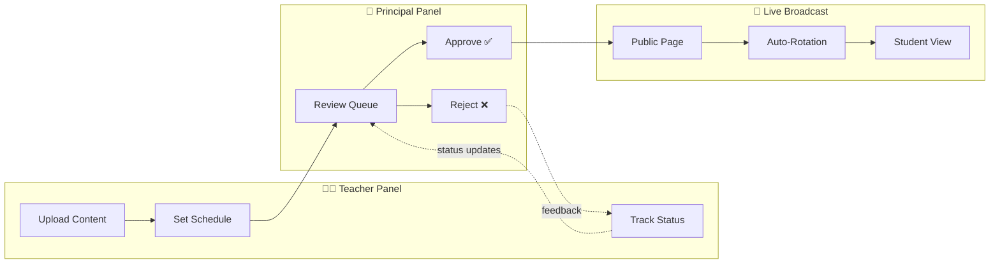
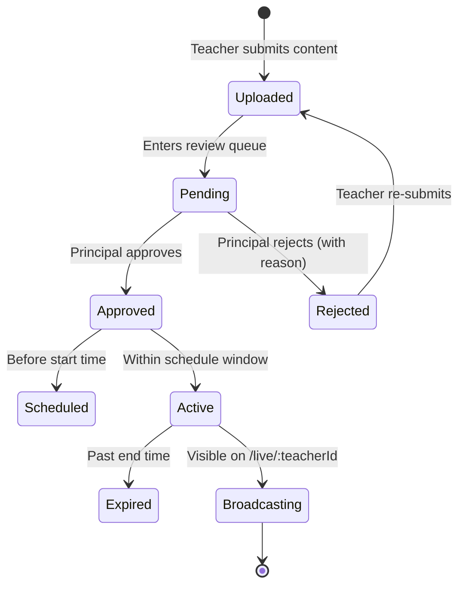
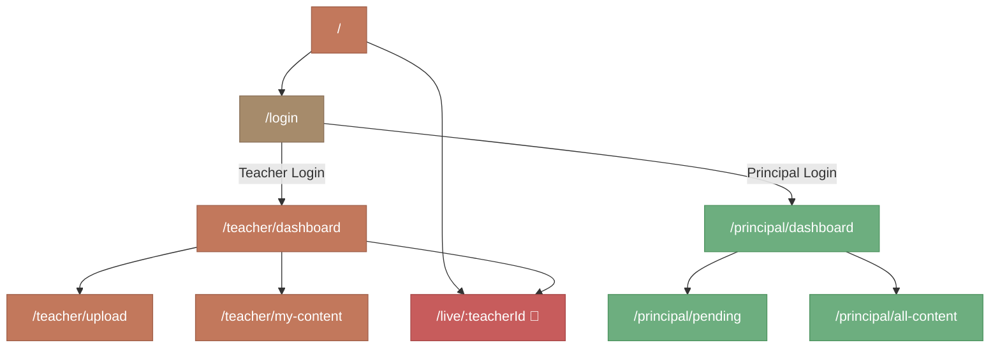
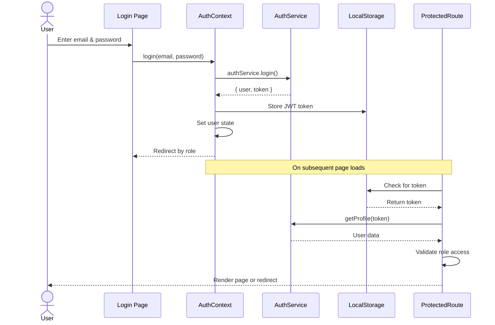
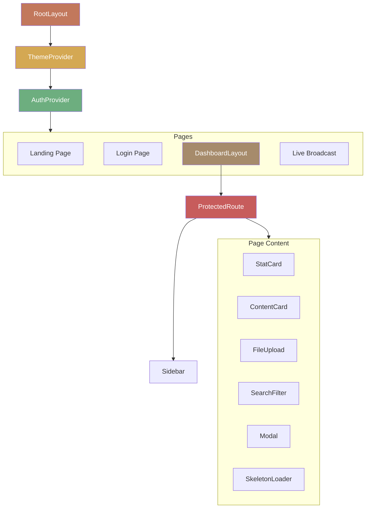

<div align="center">

<!-- Animated Capsule Banner -->


<!-- Animated Typing Effect -->
<a href="https://github.com/sonu93418/Content-Broadcasting-System">
  
</a>

<br/>

<!-- Tech Stack Badges -->
[](https://nextjs.org/)
[](https://react.dev/)
[](https://tailwindcss.com/)
[](https://developer.mozilla.org/en-US/docs/Web/JavaScript)
[](https://zustand-demo.pmnd.rs/)
[](https://zod.dev/)

<!-- Status Badges -->
[](LICENSE)
[](CONTRIBUTING.md)
[](https://github.com/sonu93418/Content-Broadcasting-System)
[](https://github.com/sonu93418)

<br/>

> 🎓 A modern educational content broadcasting platform where **teachers upload**, **principals approve**, and **students view** — all in real-time.

<br/>


</div>

<br/>


## 🌟 Overview

**ContentCast** is a full-featured content broadcasting system designed for educational institutions. It provides a streamlined three-step workflow that connects teachers, principals, and students through an elegant, real-time content delivery pipeline.

| 👨‍🏫 **Teacher** | 🏫 **Principal** | 🎓 **Student** |
|:---:|:---:|:---:|
| Upload & schedule content | Review & approve/reject | View live broadcasts |
| Track submission status | Filter & search content | Auto-rotating content |
| Dashboard analytics | Institutional overview | No login required |


## ✨ Key Features

<table>
<tr>
<td width="50%">

### 🔐 Authentication & Authorization
- Role-based login (Teacher / Principal)
- JWT token authentication
- Protected routes with role enforcement
- Auto-redirect based on user role
- Session persistence via localStorage

</td>
<td width="50%">

### 📤 Content Upload System
- Drag-and-drop file upload with preview
- Support for JPG, PNG, GIF (up to 10MB)
- Title, subject, and description fields
- Schedule with start/end times
- Form validation with React Hook Form + Zod

</td>
</tr>
<tr>
<td width="50%">

### ✅ Approval Workflow
- Pending content queue for principals
- Approve or reject with mandatory reason
- Status tracking (Pending → Approved/Rejected)
- Content filtering by status
- Search by title, subject, or teacher

</td>
<td width="50%">

### 📡 Live Broadcasting
- Public broadcast page — no login required
- Auto-rotating approved content
- 30-second polling for new content
- Countdown timer for upcoming broadcasts
- Shareable live link per teacher

</td>
</tr>
<tr>
<td width="50%">

### 🎨 Premium UI/UX
- Dark / Light theme toggle
- Glassmorphism design system
- Warm chocolate-Japanese color palette
- Skeleton loading states
- Smooth micro-animations & transitions

</td>
<td width="50%">

### 📊 Dashboard Analytics
- Visual stat cards (total, pending, approved, rejected)
- Quick action shortcuts
- Live broadcast preview
- Copy-to-clipboard broadcast link
- Responsive sidebar navigation

</td>
</tr>
</table>


## 🏗️ Architecture & Workflow Pipeline




## 🔄 Content Lifecycle




<div align="center">
<table>
<tr><td>
<p align="left">🔴 🟡 🟢 &nbsp; <b>Project Structure</b></p>

```
content_broadcasting/
│
├── 📄 package.json                    # Dependencies & scripts
├── 📄 next.config.mjs                 # Next.js configuration
├── 📄 postcss.config.mjs              # PostCSS (Tailwind) config
├── 📄 eslint.config.mjs               # ESLint configuration
├── 📄 jsconfig.json                   # Path aliases (@/)
│
├── 📂 public/                         # Static assets
│   ├── 📂 mock/                       # Demo images
│   └── 📄 *.svg                       # Icons & logos
│
└── 📂 src/
    │
    ├── 📂 app/                        # 🔹 Next.js App Router (Pages)
    │   ├── 📄 layout.js               #    Root layout (providers, fonts, meta)
    │   ├── 📄 globals.css             #    Global styles & design tokens
    │   ├── 📄 page.js                 #    Landing page (hero, features, roles)
    │   │
    │   ├── 📂 login/
    │   │   └── 📄 page.js             #    Authentication page
    │   │
    │   ├── 📂 teacher/
    │   │   ├── 📂 dashboard/
    │   │   │   └── 📄 page.js         #    Teacher dashboard (stats + actions)
    │   │   ├── 📂 upload/
    │   │   │   └── 📄 page.js         #    Content upload form
    │   │   └── 📂 my-content/
    │   │       └── 📄 page.js         #    Teacher's content listing
    │   │
    │   ├── 📂 principal/
    │   │   ├── 📂 dashboard/
    │   │   │   └── 📄 page.js         #    Principal dashboard (overview)
    │   │   ├── 📂 pending/
    │   │   │   └── 📄 page.js         #    Pending approvals queue
    │   │   └── 📂 all-content/
    │   │       └── 📄 page.js         #    All content with filters
    │   │
    │   └── 📂 live/
    │       └── 📂 [teacherId]/
    │           └── 📄 page.js         #    🔴 Public live broadcast page
    │
    ├── 📂 components/                 # 🔹 Reusable Components
    │   ├── 📂 layout/
    │   │   ├── 📄 DashboardLayout.js  #    Dashboard page wrapper
    │   │   ├── 📄 ProtectedRoute.js   #    Auth guard + role enforcement
    │   │   └── 📄 Sidebar.js          #    Responsive sidebar navigation
    │   │
    │   └── 📂 ui/
    │       ├── 📄 ContentCard.js      #    Rich content display card
    │       ├── 📄 EmptyState.js       #    Empty data placeholder
    │       ├── 📄 ErrorState.js       #    Error state with retry
    │       ├── 📄 FileUpload.js       #    Drag-and-drop file upload
    │       ├── 📄 Logo.js             #    Custom SVG logo component
    │       ├── 📄 Modal.js            #    Animated modal dialog
    │       ├── 📄 SearchFilter.js     #    Search + status filter bar
    │       ├── 📄 SkeletonLoader.js   #    Skeleton loading states
    │       ├── 📄 StatCard.js         #    Dashboard stat card
    │       ├── 📄 StatusBadge.js      #    Status indicator badge
    │       └── 📄 ThemeToggle.js      #    Dark/Light theme switch
    │
    ├── 📂 context/                    # 🔹 React Context Providers
    │   ├── 📄 AuthContext.js          #    Authentication state management
    │   └── 📄 ThemeContext.js         #    Theme (dark/light) management
    │
    ├── 📂 hooks/                      # 🔹 Custom React Hooks
    │   ├── 📄 useContent.js           #    Content data fetching hooks
    │   └── 📄 useUpload.js            #    File upload management hook
    │
    ├── 📂 services/                   # 🔹 API Service Layer
    │   ├── 📄 api-client.js           #    HTTP client + token management
    │   ├── 📄 auth.service.js         #    Authentication API calls
    │   ├── 📄 content.service.js      #    Content CRUD operations
    │   ├── 📄 approval.service.js     #    Approval/rejection API calls
    │   └── 📄 mock-data.js            #    Mock backend with delays
    │
    └── 📂 utils/                      # 🔹 Utilities
        ├── 📄 constants.js            #    Roles, statuses, routes, config
        └── 📄 helpers.js              #    Date formatting, validation, etc.
```

</td></tr>
</table>
</div>


## 🚀 Getting Started

### Prerequisites

| Tool | Version | Purpose |
|------|---------|---------|
| **Node.js** | `>= 18.x` | JavaScript runtime |
| **npm** | `>= 9.x` | Package manager |
| **Git** | `latest` | Version control |

### Installation

<div align="center">
<table>
<tr><td>
<p align="left">🔴 🟡 🟢 &nbsp; <b>Terminal</b></p>

```bash
# 1️⃣  Clone the repository
git clone https://github.com/sonu93418/Content-Broadcasting-System.git

# 2️⃣  Navigate into the project
cd Content-Broadcasting-System

# 3️⃣  Install dependencies
npm install

# 4️⃣  Start the development server
npm run dev
```

</td></tr>
</table>
</div>

> 🌐 Open **http://localhost:3000** in your browser

### Available Scripts

| Command | Description |
|---------|-------------|
| `npm run dev` | Start development server with hot-reload |
| `npm run build` | Create optimized production build |
| `npm run start` | Serve the production build |
| `npm run lint` | Run ESLint for code quality checks |


## 🔑 Demo Credentials

<table align="center">
<tr>
<th>Role</th>
<th>Email</th>
<th>Password</th>
<th>Access</th>
</tr>
<tr>
<td>👨‍🏫 <strong>Teacher</strong></td>
<td><code>teacher@school.com</code></td>
<td><code>teacher123</code></td>
<td>Upload, schedule, track content</td>
</tr>
<tr>
<td>🏫 <strong>Principal</strong></td>
<td><code>principal@school.com</code></td>
<td><code>principal123</code></td>
<td>Review, approve, reject content</td>
</tr>
<tr>
<td>🎓 <strong>Student</strong></td>
<td colspan="2"><em>No login required</em></td>
<td>View live broadcasts at <code>/live/:teacherId</code></td>
</tr>
</table>


## 🗺️ Route Map



| Route | Access | Description |
|-------|--------|-------------|
| `/` | Public | Landing page with hero, features & role cards |
| `/login` | Public | Authentication page |
| `/teacher/dashboard` | 🔒 Teacher | Stats overview, quick actions, live preview |
| `/teacher/upload` | 🔒 Teacher | Content upload form with scheduling |
| `/teacher/my-content` | 🔒 Teacher | List & track submitted content |
| `/principal/dashboard` | 🔒 Principal | Institutional overview & analytics |
| `/principal/pending` | 🔒 Principal | Pending approval queue with actions |
| `/principal/all-content` | 🔒 Principal | All content with search & filters |
| `/live/:teacherId` | 🌐 Public | Live broadcast page (no auth) |


## 🔐 Authentication Flow




## 🛠️ Tech Stack Deep Dive

<table>
<tr>
<th>Category</th>
<th>Technology</th>
<th>Purpose</th>
</tr>
<tr>
<td><strong>Framework</strong></td>
<td>Next.js 16 (App Router)</td>
<td>File-based routing, SSR, layouts</td>
</tr>
<tr>
<td><strong>UI Library</strong></td>
<td>React 19</td>
<td>Component architecture, hooks</td>
</tr>
<tr>
<td><strong>Styling</strong></td>
<td>Tailwind CSS 4</td>
<td>Utility-first CSS + custom design tokens</td>
</tr>
<tr>
<td><strong>Forms</strong></td>
<td>React Hook Form + Zod</td>
<td>Form state, validation schemas</td>
</tr>
<tr>
<td><strong>State</strong></td>
<td>React Context + Zustand</td>
<td>Auth state, theme, global store</td>
</tr>
<tr>
<td><strong>HTTP Client</strong></td>
<td>Axios + Fetch API</td>
<td>API calls with token management</td>
</tr>
<tr>
<td><strong>Icons</strong></td>
<td>React Icons (Heroicons v2)</td>
<td>Consistent icon system</td>
</tr>
<tr>
<td><strong>Date Utils</strong></td>
<td>date-fns</td>
<td>Date formatting, comparison</td>
</tr>
<tr>
<td><strong>Notifications</strong></td>
<td>React Hot Toast</td>
<td>Toast notifications</td>
</tr>
<tr>
<td><strong>Typography</strong></td>
<td>Google Fonts (Inter)</td>
<td>Modern, clean font family</td>
</tr>
</table>


## 🔌 API Service Layer

The app uses a **clean service layer pattern** — no direct API calls in components.

<div align="center">
<table>
<tr><td>
<p align="left">🔴 🟡 🟢 &nbsp; <b>Data Flow</b></p>

```
Component → Custom Hook → Service → API Client / Mock Data
```

</td></tr>
</table>
</div>

### Connecting to a Real Backend

The mock layer is designed for **zero-friction replacement**. Each service method includes a comment showing the real API equivalent:

<div align="center">
<table>
<tr><td>
<p align="left">🔴 🟡 🟢 &nbsp; <b>content.service.js</b></p>

```javascript
// content.service.js — Current (mock)
async getAll(filters = {}) {
  return mockContentService.getAll(filters);
}

// content.service.js — Real backend
async getAll(filters = {}) {
  return apiCall('GET', `/api/content?${new URLSearchParams(filters)}`);
}
```

</td></tr>
</table>
</div>

**Steps to connect a real backend:**

| Step | Action |
|------|--------|
| 1 | Update `API_BASE_URL` in `src/utils/constants.js` |
| 2 | Uncomment `apiCall` imports in service files |
| 3 | Replace `mockService.*()` calls with `apiCall()` |
| 4 | Adjust request/response shapes as needed |

### API Endpoints Expected

| Method | Endpoint | Description |
|--------|----------|-------------|
| `POST` | `/api/auth/login` | User authentication |
| `GET` | `/api/auth/profile` | Get current user profile |
| `GET` | `/api/content` | List content (with query filters) |
| `GET` | `/api/content/:id` | Get single content item |
| `POST` | `/api/content` | Create new content (multipart) |
| `GET` | `/api/content/live/:teacherId` | Get active broadcast content |
| `GET` | `/api/content/stats` | Get content statistics |
| `GET` | `/api/content/scheduled/:teacherId` | Get upcoming scheduled content |
| `PUT` | `/api/approval/:id/approve` | Approve content |
| `PUT` | `/api/approval/:id/reject` | Reject content (with reason) |


## 🎨 Design System

### Color Palette

| Token | Color | Usage |
|-------|-------|-------|
| `--color-primary` | `#C2785C` | Primary actions, brand identity |
| Success | `#6DAE7F` | Approved status, principal theme |
| Warning | `#D4A853` | Pending status, student theme |
| Danger | `#C75C5C` | Rejected status, live indicator |
| Neutral | `#A68B6B` | Muted accents, scheduling |

### Theme Support

| Feature | Dark Mode | Light Mode |
|---------|-----------|------------|
| Background | Deep charcoal tones | Clean warm whites |
| Cards | Glassmorphism with blur | Subtle shadows |
| Text | Light on dark | Dark on light |
| Persistence | `localStorage` | Auto-detects OS preference |


## 📋 Component Architecture




## ⚙️ Configuration

### Environment Variables

| Variable | Default | Description |
|----------|---------|-------------|
| `NEXT_PUBLIC_API_URL` | `http://localhost:3000/api` | Backend API base URL |

### File Upload Constraints

| Constraint | Value |
|------------|-------|
| Allowed Types | `JPG`, `PNG`, `GIF` |
| Max File Size | `10 MB` |
| Upload Method | Drag-and-drop + click |
| Preview | Instant blob URL preview |

### Live Broadcast Settings

| Setting | Value |
|---------|-------|
| Polling Interval | `30 seconds` |
| Content Rotation | Based on `rotationDuration` field |
| Schedule Computation | Client-side from timestamps |
| Access | Public (no authentication) |


## 🧪 Mock Data System

The project includes a complete mock backend (`src/services/mock-data.js`) that simulates:

- ⏱️ **Network delays** — 600-1000ms simulated latency
- 👤 **User accounts** — Pre-configured teacher & principal
- 📚 **Sample content** — Indian educational theme content items
- 🔄 **CRUD operations** — Create, read, update operations
- 📊 **Statistics** — Dynamic stat computation
- ⚠️ **Error simulation** — Toggle-able via `SIMULATE_ERRORS` flag


## 📱 Responsive Design

| Breakpoint | Layout |
|------------|--------|
| `< 640px` | Mobile — stacked layout, hamburger menu |
| `640px - 1024px` | Tablet — adaptive grid, slide-out sidebar |
| `> 1024px` | Desktop — full sidebar, multi-column grids |


## 🤝 Contributing

Contributions are welcome! Here's how:

<div align="center">
<table>
<tr><td>
<p align="left">🔴 🟡 🟢 &nbsp; <b>Terminal</b></p>

```bash
# 1. Fork the repository
# 2. Create a feature branch
git checkout -b feature/amazing-feature

# 3. Make your changes and commit
git commit -m "feat: add amazing feature"

# 4. Push to your fork
git push origin feature/amazing-feature

# 5. Open a Pull Request
```

</td></tr>
</table>
</div>


## 📄 License

This project is licensed under the **MIT License** — see the [LICENSE](LICENSE) file for details.

<br/>

<div align="center">


<br/>

<!-- Animated Footer Typing -->
<a href="https://github.com/sonu93418">
  
</a>

<br/>

[](https://github.com/sonu93418/Content-Broadcasting-System)
[](https://github.com/sonu93418/Content-Broadcasting-System)
[](https://github.com/sonu93418/Content-Broadcasting-System)

<br/>

---

### 👨‍💻 Developed by

<a href="https://github.com/sonu93418">
  
</a>

<br/>

<a href="https://github.com/sonu93418">
  
</a>

<br/>

<sub>ContentCast © 2026 • Made with ❤️ by <a href="https://github.com/sonu93418"><b>Sonu Ray</b></a></sub>

<!-- Footer Wave -->


</div>
